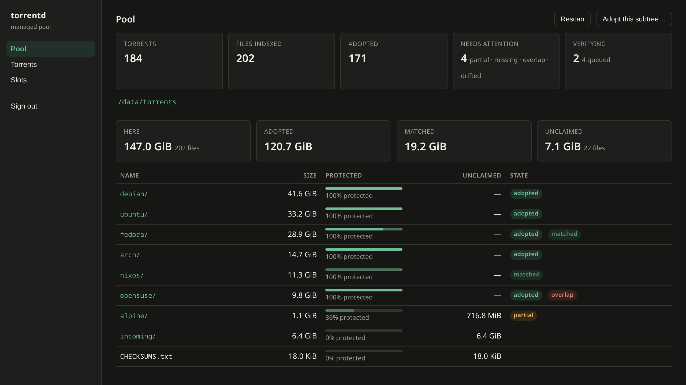

# torrentd

A headless, Linux-only **torrent seeding daemon** built on libtorrent, for
serving a large library from a server you already own. It is controlled by a
TOML file and an HTTP API, emits JSON logs and Prometheus metrics, and ships a
web client embedded in the binary.

Its distinguishing feature is that it understands the *pool*, not just the
torrents: which bytes on disk a torrent protects, which nothing protects, and
which torrents point at data that moved or vanished.



## Features

- [x] **Seeds torrents whose payload already exists on disk**, at library scale
- [x] **Never downloads payload.** Every add carries libtorrent's `upload_mode`
      — "will not make any piece requests" — so the guarantee survives magnets,
      hash failures and rechecks. Magnet *metadata* still arrives.
- [x] **Understands the pool, not just the torrents** — which bytes on disk a
      torrent protects, which nothing protects, and which torrents point at
      data that moved or vanished
- [x] **Moves and deletes files inside the directories you give it**, planned,
      journaled and re-checked at apply time. Off unless you turn it on.
- [x] **Profiles**: one libtorrent session each, with its own network posture,
      identity and directories. No implicit profile, no default one.
- [x] **VPN-bound profiles** for multi-account private-tracker seeding —
      source-bound sockets, DHT/PEX/LSD off, tunnel health monitoring, an
      opt-in nftables kill switch, and NAT-PMP port forwarding
- [x] **Verifiable in isolation**: `torrentd --config … vpn check` exercises a
      real tunnel with no torrents, no tracker and no session
- [x] **Secure by default**: it will not start unauthenticated without being
      told to, and never at all on a routable address
- [x] **Reverse-proxy native**: correct behind a cache, never terminates TLS
- [x] HTTP API, JSON logs, Prometheus metrics, and an embedded web client
- [ ] **Downloading torrents.** Deliberately absent today; every piece of the
      machinery exists except the policy, and enabling it is a decision about
      what this daemon is, not a missing feature
- [ ] **OpenAPI 3.1 description** of the HTTP API, replacing the table below
- [ ] **Grafana dashboard and alert rules** shipped in `deploy/`
- [ ] **Sequential streaming, RSS, torrent creation, auto-discovery,
      multi-instance coordination.** Not planned. You tell it what to load.

Linux x86-64 only.

## Quick start

```bash
mise install && mise run native                     # submodules + libtorrent, 5–15 min, once
cargo build --workspace --release
./target/release/torrentd --config /etc/torrentd/torrentd.toml
```

`mise run native` fetches the vendored submodules and builds Boost and
libtorrent into a content-addressed prefix outside `target/`, so you pay for
it once per pinned version rather than once per build directory.
[`CONTRIBUTING.md`](CONTRIBUTING.md) has the rest of the developer setup. Node
is a build dependency of the default feature set and the build panics without
it; **§3 of [`docs/running.md`](docs/running.md#3-build) has how to build
without it.**

**For a real deployment, follow [`docs/running.md`](docs/running.md).** It has
the parts that are easy to get wrong: the service user, which directories must
pre-exist, the auth bootstrap order, ulimits, and drills worth running on a
scratch pool before you point this at anything you care about.

## Managed pool

Point `[pool] roots` at directories torrentd should know about and
`library_dir` at a directory of `.torrent` files. It indexes both, matches
them, and reports per path:

| State | Meaning |
| --- | --- |
| `adopted` | Loaded into a session and seeding. |
| `matched` | Every file resolved on disk; not yet loaded. |
| `partial` | Only some files present. Adoption is refused — seeding it would advertise pieces the daemon cannot serve. |
| `missing` | No payload found under any root. |
| `drifted` | A claimed file's size, mtime or inode changed since the last scan. Needs verification. |
| `overlap` | Two torrents claim the same file. Blocks any mutation touching those bytes. |

Plus byte rollups per directory, so an unprotected subtree is visible without
reading a file listing.

Change detection is tiered because hashing a petabyte is days of I/O: a
`(size, mtime, inode)` sweep catches essentially every real change cheaply,
and libtorrent's own piece hashing is the authoritative check, run on adopt
and on drift. A v2 torrent's per-file merkle root identifies a file wherever
it moved; v1 torrents have no per-file digest, so they match on `(path, size)`
and are confirmed only by verification.

**Migrating from another client is just the first scan** — point
`library_dir` at its state directory. The details are in
[`deploy/torrentd.sample.toml`](deploy/torrentd.sample.toml) next to the key
you set.

```bash
torrentd --config … pool scan      # index + match
torrentd --config … pool status    # summarise
torrentd --config … pool check     # what changed since the scan
torrentd --config … pool orphans   # unclaimed bytes
```

Adoption is tiered too: if the previous client's `.fastresume` says the
torrent was complete and every file still matches the index, it is added in
seed mode and seeds immediately; otherwise libtorrent hashes it first.
Verifications are admitted a bounded number at a time so a bulk adopt cannot
starve what is already seeding.

### Reorganising

Requires `allow_mutations = true`. A mistake here destroys data, so:

- **Plan, then apply.** `POST /api/pool/plans` computes the steps and touches
  nothing; you see the exact diff first.
- **Journaled.** Each step is written before it is attempted, so a crash
  leaves a step whose outcome is unknown rather than a half-applied
  reorganisation silently resumed. Startup re-drives what it safely can and
  parks the rest as `failed`, where you can inspect and discard it.
- **Adopted payload moves through libtorrent** (`move_storage`), and the step
  is not complete until libtorrent confirms it — the torrent keeps seeding
  across the move.
- **Hard refusals**, re-checked at apply time and not merely at plan time: a
  file two torrents claim, payload that changed since the scan, a destination
  that already exists, a directory holding anything but that torrent's own
  files, and any path that resolves outside its root once symlinks are
  followed.
- **Deletion targets only provably unclaimed files** — re-stat'd at the moment
  of deletion, refused outright if any torrent has been loaded that the
  matcher has not yet placed, and gated on echoing back a `confirm` token
  derived from the plan.

## HTTP API

Everything is served under `/api/…`. `/healthz` and `/metrics` stay at the
root, where probes and scrapes conventionally look. Default bind
`127.0.0.1:8080`. Safe methods need the `read` scope and everything else
needs `write`, derived from the method rather than listed per route — so a
route added under `/api` cannot be added without a gate. Three routes are
mounted on the root router outside both middleware layers — `/healthz`,
`/api/login` and `/api/logout`, the rows below carrying scope **none**. A
route added at that level is ungated, and the method-derived scoping does not
catch it. (`/metrics` also sits at the root, but under its own `metrics`-scope
layer.)

| Method & path | Scope | Purpose |
| --- | --- | --- |
| `GET /healthz` | **none** | Liveness. 503 before a session is up, if the alert loop stops advancing, or if every profile is fenced. |
| `GET /metrics` | `metrics` | Prometheus text format. |
| `POST /api/login` \| `/api/logout` | **none** | Session cookie in, revocation out. 409 if the daemon runs unauthenticated. |
| `GET /api/status` | read | Counts by phase, aggregate rates, peers. |
| `GET /api/events` | read | SSE change stream — a bare tick; the client refetches. |
| `POST /api/reload` | write | Re-read the config file, as SIGHUP does. |
| `GET /api/torrents` | read | `?after=<infohash>&limit=<n>` (default 100, max 1000) → `{"items":[…],"next_cursor":…}`. |
| `POST /api/torrents` | write | `{"profile_id":…}` plus `{"magnet":…}`, `{"torrent_path":…}`, or a multipart `.torrent` in a field named `torrent`. `save_path` is optional and defaults to `default_save_path`. 409 on a duplicate info-hash. |
| `GET`/`DELETE` `/api/torrents/:infohash` | read/write | `?delete_files=true` requires `[pool] allow_mutations`. |
| `POST /api/torrents/:infohash/pause` \| `/resume` | write | `resume` is 409 while the profile is fenced. |
| `POST /api/torrents/:infohash/upload-limit` | write | `{"bytes_per_sec":…}`, 0 = unlimited. |
| `POST /api/torrents/:infohash/file-priority` | write | `{"file_idx":…,"priority":…}`, priority 0–7 (0 skip, 1 low, 4 normal, 7 high). |
| `GET /api/profiles`, `/profiles/:id`, `/profiles/:id/torrents` | read | |
| `POST /api/profiles/:id/pause-all` \| `/resume-all` | write | `resume-all` is 409 while fenced. |

With `[pool]` configured: `GET /api/pool`, `/pool/tree`, `/pool/torrents`,
`/pool/orphans`, `/pool/drift`; `POST /api/pool/scan`, `/pool/adopt`,
`/pool/verify`; and the plan surface `GET`/`POST /api/pool/plans`,
`GET`/`DELETE /api/pool/plans/:id`, `POST /api/pool/plans/:id/apply`. Of
these, only creating and applying a plan are gated on `allow_mutations`.

**Input is confined, not just size-capped.** The 50 MiB body limit is the
least of it: `torrent_path` reads from the daemon's own filesystem and is
restricted to `torrent_dir`, the pool library and the managed roots, with a
64 MiB cap and errors that do not disclose whether a path exists. `save_path`
must be inside `default_save_path` or a managed root, so an add cannot drop
payload into a managed tree where the matcher would read it as an orphan.

**Configuration is not settable at runtime, deliberately.** Several keys are
reloadable — `log_level`, `upload_rate_limit`, `connections_limit`,
`aio_threads`, `enable_lsd`, `max_concurrent_http_announces` — and every one
belongs to the TOML file. `enable_lsd` carries one exception: it is withheld
from every `vpn` profile on reload, because such a profile has local discovery
forced off with no key to turn it on, and a reload may not hand one back.
`POST /api/reload` asks the daemon to re-read that file; nothing lets a client
set a value, because then the file and the running daemon could disagree with
nothing recording which had won.

## Profiles

One config file drives everything; unknown keys are a fatal error, inside
`[[profile]]` tables too. See
[`deploy/torrentd.sample.toml`](deploy/torrentd.sample.toml).

A **profile** is one libtorrent session with its own network posture, identity
and directories. At least one is required, and there is no default profile:
every profile states how it reaches the network, because the alternative —
the host's own interfaces with DHT enabled — is the least private posture the
daemon has, and it should not be what you get by writing nothing. `POST
/api/torrents` therefore always requires `profile_id`.

```toml
[[profile]]
id                = "public"
network           = "host"          # binds this machine's interfaces
listen_interfaces = "0.0.0.0:6881,[::]:6881"
dht               = true            # off unless written

[[profile]]
id                   = "account_a"
network              = "vpn"        # binds a tunnel; dht/pex/lsd forced off
vpn_type             = "wireguard"
vpn_config           = "/etc/wireguard/wg-acct-a.conf"
vpn_interface        = "wg-acct-a"
port_forward         = "natpmp"
peer_fingerprint_hex = "a1b2c3d4e5f60718"
user_agent           = "qBittorrent/5.0.3"
```

A `vpn` profile pins every socket to its tunnel address and disables DHT, PEX
and LSD unconditionally — there is no key that turns them back on. Its
listening port is either static or negotiated over NAT-PMP against the tunnel
gateway (ProtonVPN/PIA-style ephemeral ports, renewed continuously, with the
live socket rebinding when it changes).

Verify a tunnel before trusting it, with no torrents involved:

```bash
torrentd --config … vpn check          # add --bring-up to raise the tunnels
```

## Security posture

Private trackers ban permanently for cross-contamination between accounts, so
a `vpn` profile's isolation is layered:

- **Tunnel binding** — listen and outgoing sockets are source-bound to the
  tunnel address, never `0.0.0.0`, and DHT, PEX and LSD are off with no key to
  turn them on, so seeding is tracker-only.
- **Health monitor** — every 30s it checks the tunnel address and, for
  WireGuard, the latest-handshake age. On loss, change, or a stale handshake it
  pauses that profile's torrents and **fences** it: no auto-restart, and
  `add`/`resume` return 409 until an operator intervenes.
- **Kill switch** (opt-in) — a fail-closed nftables table confining the
  daemon's egress to loopback and its tunnel interfaces, so a dropped tunnel
  fails closed at the kernel regardless of socket binds or poll timing.

**Checking a tunnel without seeding anything** — `vpn check` runs the VPN
pre-flight the daemon depends on and reports each part separately, with no
libtorrent session, no torrents and no tracker contact.

```bash
torrentd --config … vpn check                            # every profile
torrentd --config … vpn check --profile acct_a --json    # one profile, machine-readable
torrentd --config … vpn check --egress 1.1.1.1:53      # prove traffic leaves the tunnel
```

Verdicts are four-valued — `pass`, `fail`, `skip`, `unknown` — so a green
summary cannot quietly mean "mostly not checked", and the exit status carries
the same distinction: `0` clean, `1` any failure, `2` nothing failed but
something could not be checked.

Safe to run while the daemon is up. The default path reads state and asks the
gateway for a NAT-PMP mapping with the daemon's own short lease, which it
leaves to expire; `--bring-up` is the only option that raises a tunnel, and it
lowers again only what it raised. What a pass does and does not establish is
set out in [docs/running.md](docs/running.md#9-first-run-checks).

The eight rules this is built on, and why each exists, are documented on the
`torrentd-engine::profile` module — where the code that enforces them is. The
operational side of each knob, including what the kill switch costs and what
it needs, is in [`deploy/torrentd.sample.toml`](deploy/torrentd.sample.toml),
which is the file an operator actually edits.

`allowed_tracker_domains` is a *misconfiguration guard* for `.torrent` adds —
it catches loading one account's torrent into another — not an egress control,
and it is empty by default. Public content that wants DHT belongs in a
`network = "host"` profile.

## Authentication

**Required, one way or the other.** The daemon refuses to start unless you
have either configured `[auth]` or written `allow_unauthenticated = true`.
Without `[auth]` it authenticates nothing — every route, including every
mutating one, is open to anyone who can reach the port. That is a legitimate
posture behind a reverse proxy that does its own access control; it is not one
to arrive at by omission. The opt-out does not extend to a routable address
either: `allow_unauthenticated` with a non-loopback `http_listen` is refused,
and so is `allow_unauthenticated` alongside a configured `[auth]`, which is
inert and reads as though the daemon authenticates nothing. `http_listen`
defaults to `127.0.0.1:8080`. All three are read once, at startup: changing
them takes a restart, not a `SIGHUP`.

Two credential kinds, hashed differently on purpose. The **operator password**
is human-chosen and therefore low-entropy, so it gets Argon2id — `m=19456,
t=2, p=1`, which is OWASP's current recommendation, pinned in `auth.rs` rather
than inherited from the `argon2` crate's defaults so that a dependency bump
cannot quietly move it — verified once at login and rate-limited. **API tokens** are 256 bits this daemon generated, so there
is nothing to guess and SHA-256 is correct; Argon2 on every Prometheus scrape
would burn ~50 ms of CPU per request by design.

```bash
torrentd --config … hash-password
torrentd --config … new-token --name prometheus --scopes metrics
```

The token is printed once and never stored; only its hash goes in the config.
`POST /api/login` returns an `HttpOnly; SameSite=Strict` cookie — `SameSite`
is the CSRF defence for a cookie-authenticated mutating API. Sessions are
opaque random ids looked up server-side, so there is nothing to forge and
logout is a real revocation. They live in memory: a restart logs everyone out.

Scopes are coarse on purpose: `read` covers safe methods, `write` covers
anything that changes state, and `metrics` covers `/metrics` **and nothing
else**, so a scrape credential can never reach the control plane.

## Web client

Served at `/`, embedded in the binary, so a deployment stays one artifact. The
pool browser above is the primary view; there is also a virtualised torrent
list built for 100K rows and a profile view for VPN and port-forward health.

It is a static bundle with no server-side rendering — the daemon serves files
and JSON, and every route the client has is resolved in the browser. The
origin behaves properly behind a cache: strong ETags and conditional requests,
precompressed `.br`/`.gz` variants chosen on `Accept-Encoding` (226 KB of
JavaScript becomes 62 KB), fingerprinted assets marked immutable, and
`Vary: accept-encoding` so a shared cache keys on it.

Updates arrive over SSE: the daemon emits a tick when something visible
changes and the client refetches only the panels it has mounted. Polling every
15s is the fallback when the stream drops.

```bash
cd web && npm run dev     # dev server, proxying the API to :8080
mise run screenshot       # regenerate the image above from a fixture
```

## Reverse proxy

torrentd does not terminate TLS and will not; `deploy/Caddyfile` and
`deploy/compose.yaml` are a working pair that does. `X-Forwarded-For` and
`X-Forwarded-Proto` are read **only** from peers listed in `trusted_proxies`
— empty by default, meaning no forwarding header is read at all and the
socket's peer address is the client. They feed exactly two things: a per-client
login throttle instead of one shared bucket, and `Secure` on the session
cookie when the original request was over TLS.

## Metrics

`GET /metrics`, Prometheus text format, everything namespaced `torrentd_*` and
gated behind its own `metrics` scope so a scrape credential can never reach the
control plane.

Per-session series carry a `profile_id` label. Per-*torrent* series are
deliberately absent — they are unusable at 10K+ torrents, and the HTTP API
serves per-torrent status on demand.

Alongside the libtorrent gauges (`torrentd_libtorrent_*`) there are daemon
counters for torrent lifecycle, resume writes, disk and hash errors, dropped
alerts, storage moves and pool verification. Four `profile_id`-labelled series
cover tunnel health and fencing — `profile_vpn_tunnel_up`,
`profile_torrents_paused_vpn_down`, `profile_vpn_tunnel_ip_changes_total` and
`profile_vpn_fenced_total` — and they are meaningful only on a tunnelled
profile: a sample carrying the `profile_id` of a profile with no tunnel says
nothing about any tunnel, so scope a panel or an alert to the profiles you
actually tunnel rather than aggregating over every profile. Handshake age is
reported per WireGuard profile, and port-forward state per profile that
negotiates its port over NAT-PMP. `kill_switch_active` is none of these: it is
a single unlabelled daemon-wide gauge, seeded at 0 at startup whether or not
any kill switch or any `vpn` profile is configured.

> A shipped Grafana dashboard and alert rules are planned rather than present.
> Until then, note that series register on first emission, so anything not yet
> emitted reads as "no data" rather than zero — the per-profile tunnel and
> fencing series are seeded at their baseline for exactly this reason, and most
> others are not, port-forward state among them. The two handshake series
> (`profile_vpn_handshake_age_seconds`, `profile_vpn_handshake_probe_ok`) are
> not seeded: they exist only for WireGuard profiles and register on the first
> probe, so an alert on either reads "no data" until the first poll completes,
> and permanently on a `vpn` profile that is not WireGuard.

## Deployment

`deploy/` has a hardened systemd unit (`Type=notify`, `--check-config`
pre-flight, resource limits), a multi-stage `Containerfile`, and a
`compose.yaml`. Run torrentd as its own user. Setup is
[`docs/running.md`](docs/running.md).

## Testing

Every command lives in [`mise.toml`](mise.toml), which is what CI runs.

```bash
mise run check           # fmt + clippy, warnings denied
mise run test            # unit + in-memory; no libtorrent, no network
mise run test-shim       # Layer 2: the C ABI boundary
mise run test-lifecycle  # Layer 3: real libtorrent against real disk
mise run test-daemon     # Layer 3: spawns the binary, drives it over HTTP
mise run test-all        # all of the above
mise run bench -- memory-scaling --count 50000   # Layer 4: manual, minutes
```

Against a real VPN, with no torrents and no tracker involved:

```bash
mise run vpn-check /etc/torrentd/torrentd.toml
```

## Contributing & license

Development setup, coding standards and the commit convention are in
[`CONTRIBUTING.md`](CONTRIBUTING.md). Apache-2.0, see [`LICENSE`](LICENSE).
